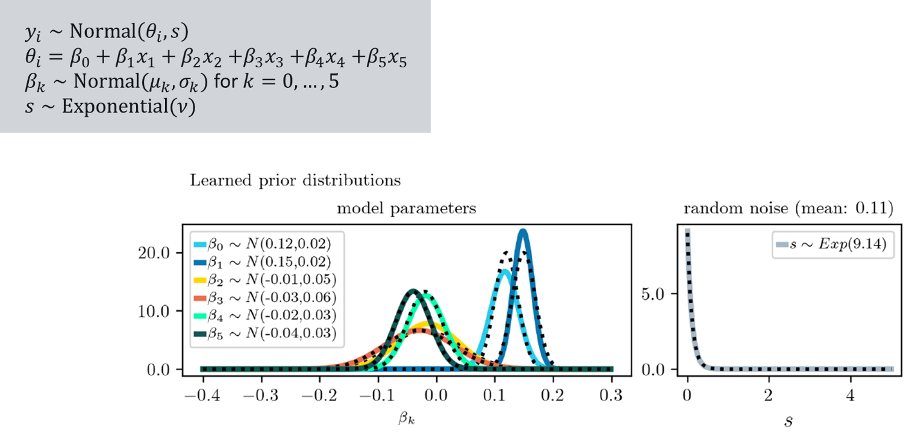

.. Make-My-Prior documentation master file, created by
   sphinx-quickstart on Mon Oct 30 10:23:38 2023.
   You can adapt this file completely to your liking, but it should at least
   contain the root `toctree` directive.

Case Studies
############

Normal regression model
=======================

Normal regression model with a :math:`2 \times 3` between-participant factorial design. 
In this case study, a total of 13 hyperparameters, :math:`\lambda = (\mu_k, \sigma_k, \nu)`, is learned through expert knowledge.
Case study is inspired by the experimental design of truth-effect studies in the field of social cognition.

+ *Target quantities:*  Marginal distribution for both factors (1,2), distribution of effects for each level of the second factor (3), distribution of the expected R2 (4)
+ *Elicited statistics:* Quantile-based elicitation for (1-3) and histogram elicitation for (4). 

|:arrow_forward:| :doc:`Go to the case study <notebooks/normal_model>`

Binomial regression model
==========================

.. image:: _static/icon_cs_binomial.png
  :width: 400
  :alt: Binomial regression model

Binomial regression model with logit link and one continuous predictor. The goal is to learn 4 hyperparameter values. 
Case study uses the Haberman’s survival dataset which contains cases from a study on the survival
of patients who had undergone surgery for breast cancer.

+ *Target quantities:*  expected number of patients who died within five years for different numbers of axillary nodes
+ *Elicited statistics:* Quantile-based elicitation for each selected design point

|:arrow_forward:| :doc:`Go to the case study <notebooks/binomial_model>`

Poisson regression model
==========================

.. image:: _static/icon_cs_poisson.png
  :width: 400
  :alt: Poisson regression model

Poisson regression model with log link and one continuous and one categorical predictor with three levels. The goal is to learn 8 hyperparameter values. 
Case study uses a data set of a study which investigates the number of LGBTQ+ anti-discrimination laws in each US state.

+ *Target quantities:*  predictive distribution of the group means for the categorical variable (1) and the expected number of LGBTQ+ anti-discrimination laws for selected US states (2)
+ *Elicited statistics:* Quantile-based elicitation for (1) and histogram-based elicitation for each selected design point (2)

|:arrow_forward:| :doc:`Go to the case study <notebooks/poisson_model>`

Multilevel model with normal likelihood
=======================================

.. image:: _static/icon_cs_mlm.png
  :width: 400
  :alt: Multilevel model with normal likelihood

Multilevel model with normal likelihood and one continuous predictor. The goal is to learn 7 hyperparameter values.
The case study draws inspiration from the *sleepstudy* dataset that comes along with the R-package *lme4*. 

+ *Target quantities:* the expected average outcome for specific design points :math:`x_i` (1), the within-person standard deviation *s* (2), and the expected distribution of :math:`R^2` (3).
+ *Elicited statistics:* quantile-based elicitation for the expected average outcome per :math:`x_i`, moment-based elicitation for the standard deviation *s*, and histogram-elicitation for the expected :math:`R^2` distribution

|:arrow_forward:| :doc:`Go to the case study <notebooks/multilevel_model>`